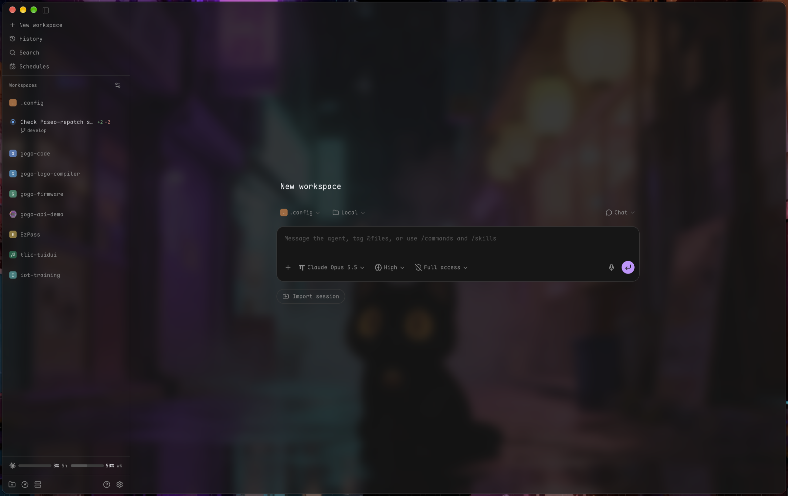

<div align="center">

# Paseo-Vibrancy

**A frosted-glass Paseo for macOS, rebuilt and kept up to date from inside the app.**

[](LICENSE)
[](https://paseo.sh)
[](#requirements)



</div>

---

Paseo's window is opaque, and Electron gives plugins no way to change that. Paseo-Vibrancy builds a patched copy of Paseo, `~/Applications/Paseo-Vibrancy.app`, with a see-through window and a real background blur. Its own settings screen then tunes the look live.

## Features

- **Live glass**: material, blur radius, tint and main-pane glass, applied without a restart.
- **Self-updating**: checks Paseo's GitHub releases, verifies each download against Paseo's Developer ID signature, and rebuilds the copy.
- **Readable on glass**: menus, dialogs, toasts and the diff view stay opaque.
- **Calmer while agents run**: spinners and shimmers are stepped instead of animating every frame, which cuts WindowServer load.

## Requirements

- macOS on Apple silicon
- [Paseo](https://paseo.sh) 0.11.0-beta.3 or later, with **Settings > Plugins > Enable plugins** on
- Xcode Command Line Tools (`xcode-select --install`) for the blur radius; without them, the Apple materials still work

## Install

In Paseo, open **Settings > Plugins**, paste the source below into **Plugin source** and press **Install plugin**:

```
github:MomePP/Paseo-Vibrancy
```

Or from a terminal:

```sh
paseo plugin install github:MomePP/Paseo-Vibrancy
```

## Build your copy

1. Open **Settings > Plugins**, then `...` next to **paseo-vibrancy**, then **Vibrancy**.
2. Press **Rebuild & restart**. The build takes under a minute; the first one also downloads Paseo, about 180 MB. Paseo then quits, and the copy opens on its own.
3. From now on, launch **Paseo-Vibrancy** instead of Paseo. Both share the same data, so only run one at a time.

Rebuilding restarts Paseo's daemon, which interrupts any running agents.

## Settings

| Control | Range | Default | Effect |
| --- | --- | --- | --- |
| Material | `none`, `sidebar`, `hud`, `under-window`, ... | `none` | An Apple vibrancy material. `none` uses the blur radius instead. |
| Blur radius | 0 - 60 | 30 | Background blur behind the window, used when Material is `none`. |
| Tint | 0 - 100% | 85% | How much of the theme colour washes over the blur. |
| Main pane glass | on / off | on | Extends the glass behind chats and editors; off keeps the main pane solid. |

The **Build** card shows the running and latest Paseo versions, plus the report from the last build:

- **Check for updates** checks GitHub for a newer Paseo release.
- **Update & restart** downloads that release and rebuilds onto it.
- **Rebuild & restart** rebuilds from the release you are already running.

A sidebar notice appears when a newer Paseo release exists, or when the plugin has changed since your copy was built.

## Opinionated defaults

These come built into every copy and have no setting:

- **Terminal**: font size 13.5, line height 1.1, weights 400 / 600, bar cursor and 10px left padding. Each of these yields to your Ghostty config (`~/.config/ghostty/config`) when it sets `font-family`, `font-style`, `font-style-bold`, `cursor-style` or `adjust-cell-height`. The fixed font size overrides Paseo's Code size setting in the terminal.
- **Terminal colours**: the [Oxocarbon](https://github.com/nyoom-engineering/oxocarbon.nvim) ANSI palette. Pair it with [Paseo-Oxocarbon](https://github.com/MomePP/Paseo-Oxocarbon) to match the rest of the app.

## How it works

- The plugin's server half downloads the matching Paseo release and verifies it twice: by checksum, and by Paseo's Developer ID signature.
- It then patches a copy, adds a small main-process hook and a native blur module, and signs the copy ad-hoc.
- macOS refuses to launch a modified bundle that still carries Paseo's original signature, so the copy has to live separately and update through the plugin. Paseo's own updater is switched off inside the copy.
- Every patch is matched by content. If a Paseo release moves one, the build report lists it as `MISSED` and the rest still apply.

## Files

| Path | Purpose |
| --- | --- |
| `~/Applications/Paseo-Vibrancy.app` | The patched copy |
| `~/Library/Application Support/Paseo/paseo-vibrancy.json` | Live appearance settings |
| `~/Library/Caches/paseo-vibrancy/` | Verified Paseo downloads |
| `~/Library/Logs/paseo-vibrancy-swap.log` | What happened during the last restart |

## Uninstall

```sh
paseo plugin remove paseo-vibrancy
rm -rf ~/Applications/Paseo-Vibrancy.app ~/Library/Caches/paseo-vibrancy ~/Library/Application\ Support/Paseo/paseo-vibrancy.json ~/Library/Logs/paseo-vibrancy-swap.log
```

Then launch the regular Paseo again.

## Development

```sh
npm install
npm test
npm run typecheck
```

After editing, run `paseo plugin reload paseo-vibrancy`. Changes to the patches only take effect after a rebuild. Notes on internals and gotchas are in [`.claude/knowledges/paseo-vibrancy.md`](.claude/knowledges/paseo-vibrancy.md).

## License

[MIT](LICENSE)
